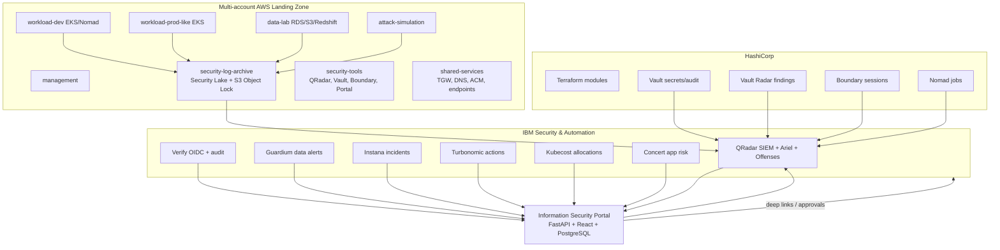

# IBM Security + HashiCorp on AWS Security Lab

## Project purpose
This repository is a production-like security lab blueprint integrating IBM QRadar, IBM Verify, IBM Guardium, IBM Instana, IBM Turbonomic, IBM Kubecost, IBM Concert and HashiCorp Terraform, Vault, Vault Radar, Nomad, and Boundary on AWS. The target operating model is a higher-level **Information Security Portal** that summarizes, correlates, approves, automates, and deep-links into the source products rather than replacing their native consoles.

> **No real secrets are committed.** IBM/HCP license keys, API tokens, and AWS credentials must be supplied through environment variables, Terraform sensitive variables, Vault, or `.env.example` templates only.

## Enterprise image and license posture
All installation images and licensing paths are modeled for **Enterprise** editions only. Real IBM/HashiCorp license keys, entitlement keys, API tokens, pull secrets, and private registry credentials are intentionally absent and must be supplied from Vault, AWS Secrets Manager, CI/CD secrets, Terraform sensitive variables, or environment variables. See `docs/enterprise-installation.md` for the enterprise image/license matrix and human review requirements.

## Architecture


## Product roles and overlap guidance
- **QRadar**: central SIEM, event search, correlation, offenses, SOC evidence.
- **Security Lake / S3 Object Lock**: immutable or long-term raw log retention.
- **Guardium**: data activity monitoring, sensitive data policy violations.
- **Verify**: enterprise IdP and OIDC source of identity truth.
- **Instana**: application health, incidents, dependency signals.
- **Kubecost**: Kubernetes allocation and cost anomaly source.
- **Turbonomic**: optimization recommendation and execution engine; execution is disabled until portal approval.
- **Concert**: application risk, compliance, certificate, SBOM, resilience context.
- **Vault**: secrets, dynamic credentials, PKI, transit, audit source.
- **Vault Radar**: secret exposure discovery across repos, S3, images, and collaboration sources.
- **Boundary**: privileged access broker and session telemetry.
- **Nomad**: runs portal, connector workers, remediation jobs, and demo scenario runners.

## QRadar audit log centralization
All audit and security events flow to QRadar using JSON syslog or LEEF generated by connector adapters. Raw copies are retained in Security Lake and/or Object Lock buckets. The portal stores normalized summaries and workflow audit events, then can forward those audit events back to QRadar.

## AWS account structure
`management`, `security-log-archive`, `security-tools`, `shared-services`, `workload-dev`, `workload-prod-like`, `data-lab`, and `attack-simulation`. Control Tower enrollment and account vending are intentionally documented as manual/TODO where APIs and organization policy vary.

## Terraform execution order
1. Prepare AWS Organizations/Control Tower manually where required.
2. `cd terraform/envs/lab && terraform init && terraform plan -var-file=terraform.tfvars`.
3. Promote reviewed patterns to `terraform/envs/prod-like` with separate state and variables.

## Local portal execution
```bash
cp portal/.env.example portal/.env
docker compose -f portal/docker-compose.yml up --build
```
Open `http://localhost:5173`; backend health is `http://localhost:8000/health`.

## Mock mode
Set `PORTAL_MODE=mock` and `CONNECTOR_MODE=mock`. Mock connectors and seed data require no external API tokens.

## Real integration environment variables
See `.env.example` and `portal/.env.example` for IBM Verify OIDC settings, QRadar URL/token, Guardium, Instana, Turbonomic, Kubecost, Concert, Vault, Vault Radar, Boundary, Nomad, and AWS role settings.

## Demo scenarios
Run `make seed` then `make demo-events`. Scenarios cover secret exposure, abnormal DB access, app outage plus cost spike, S3 sensitive exposure, and certificate expiration.

## Security warnings
Production deployment requires human review for SCPs, break-glass Vault operations, Boundary target exposure, QRadar log source creation, Turbonomic action execution, bucket retention locks, and Terraform remediation placeholders.

## TODO / not yet implemented
See `TODO.md` for production review items, incomplete real API integrations, and next implementation priorities.
